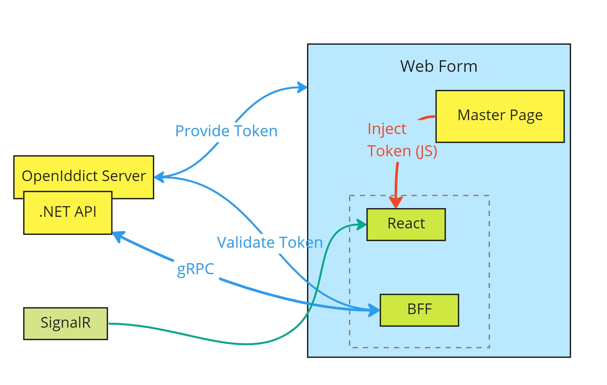

# Backend for Frontend and Micro-frontend

Demonstrate how to implement micro-frotend of legacy Web Form ASP.NET Framework.

## Projects

- [LegacyServer/AuthServer](LegacyServer/AuthServer) Used the template from [End-to-End React Oauth2 with Openiddict][react-oauth-openiddict]
- [LegacyServer/LegacyWeb](LegacyServer/LegacyWeb) Use the template from official MS ASP.NET Framework WebForm with individual Login

## Ref

### Multi Entry Point with Vite (React)
- Based on https://www.youtube.com/watch?v=STeKBm67l6M
- https://www.raulmelo.dev/blog/build-javascript-library-with-multiple-entry-points-using-vite-3

### Openiddict (.NET OAuth Lib)
- [https://dev.to/robinvanderknaap/setting-up-an-authorization-server-with-openiddict-part-iii-client-credentials-flow-55lp](https://dev.to/robinvanderknaap/setting-up-an-authorization-server-with-openiddict-part-iii-client-credentials-flow-55lp)
- [https://github.com/mildronize/DotNetCore-Sample](https://github.com/mildronize/DotNetCore-Sample)
- [End-to-End React Oauth2 with Openiddict][react-oauth-openiddict]

## ASP.NET Framework
- [OAuth/OpenID Support for WebForms, MVC and WebPages](https://devblogs.microsoft.com/dotnet/oauthopenid-support-for-webforms-mvc-and-webpages/)

<!-- Ref -->

[react-oauth-openiddict]: https://github.com/codesanook/codesanook-examples/tree/master/Codesanook.Examples.DotNetAuthorizationServer        "End-to-End React Oauth2 with Openiddict"
